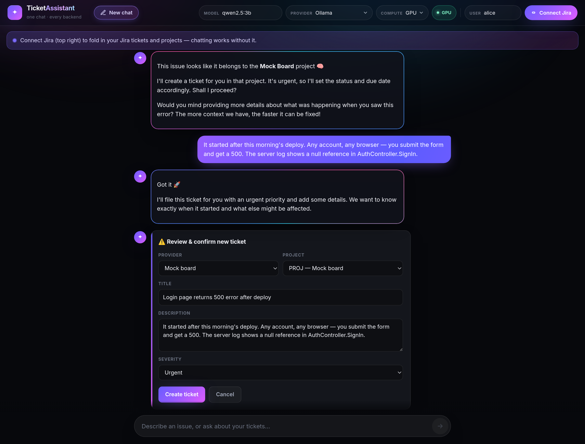
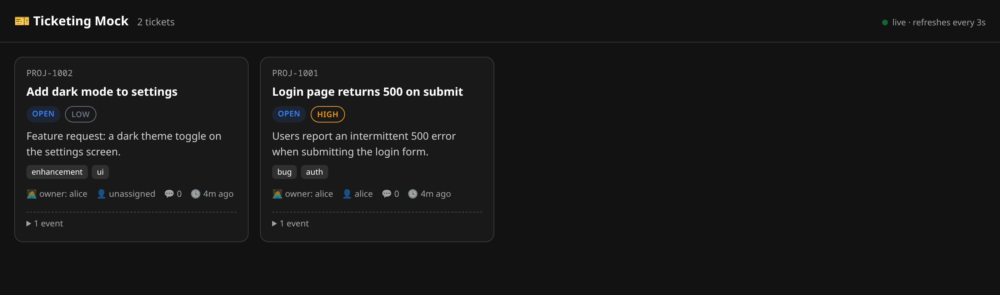
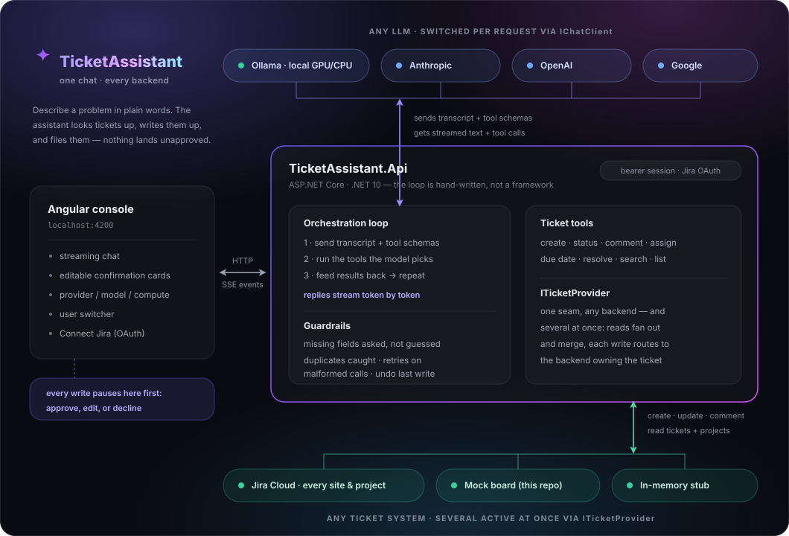
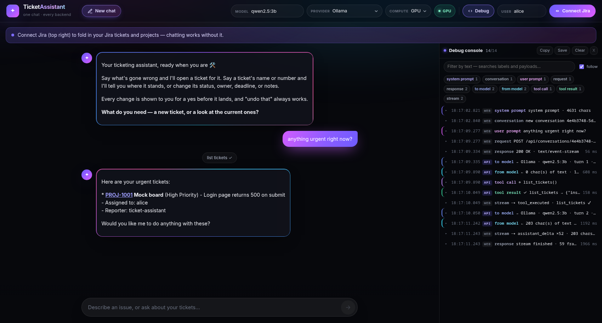

<h1 align="center">TicketAssistant</h1>

<p align="center">
  <strong>Describe a problem in plain words — get a real ticket in a real ticketing system.</strong><br>
  A chat assistant that looks up, files, and follows up on support tickets, driven by a
  hand-written LLM tool-calling loop that pauses for your approval before it changes anything.
</p>

<p align="center">
  
  
  
  
  
</p>

<p align="center">
  
</p>

> [!WARNING]
> **Proof of concept.** An exploratory prototype for learning and demonstration, **not**
> production software: in-memory storage, sessions minted on request without a login, and a
> small local model by default. See [Caveats](#caveats-its-a-poc).

## What it does

You type *"nobody can sign in since this morning's deploy"*. The assistant asks for anything it
still needs, warns you if a similar ticket already exists, and hands back a **confirmation card you
can edit** — title, description, severity, and which system and project it should land in. Approve it
and the ticket is created for real; say *"undo that"* and it's reversed.

It also keeps track of what you already have: **look up · search · list by status, priority or kind ·
summarize where everything stands · reopen · comment · assign · resolve with a note · set due dates
and flag anything overdue · undo the last change.** Every ticket keeps an audit trail of what changed
and when.

That's everything you raised **and everything assigned to you**, of every kind — tickets, tasks,
bugs, stories — kept apart rather than lumped together, so *"what tasks do I have?"* and *"open a
task for that"* mean what they say.

Two things it is deliberately not shy about:

- **Any LLM.** Ollama (local, no API key), Anthropic, OpenAI, or Google — switched from the console's
  dropdown, per request, with no restart.
- **Any ticketing system, several at once.** A real Jira Cloud account (every site and project the
  user can reach, via per-user OAuth), the mock board in this repo, an in-memory stub — or a
  combination. Reads merge across all of them; each write routes to the backend that owns the ticket.

## Quick start

```bash
git clone https://github.com/eduarddubau/TicketAssistant.git && cd TicketAssistant
./up.sh          # Linux / macOS / WSL2   —   .\up.ps1 on Windows PowerShell
```

That's it: no API key, no .NET SDK, no Node. The script runs in the foreground through six visible
stages — GPU check, Ollama image, build, container start, chat-model download, and a final report of
what Ollama actually ended up running on — retrying every download so a network blip doesn't turn
into debugging, and ending with **"✔ Success"** once the assistant can actually answer. The model is
loaded on the GPU and kept loaded, so the *first* message is as fast as the rest.

Then open:

| | |
| --- | --- |
| **Console** — the app, start here | <http://localhost:4200/> |
| **Ticket board** — the "external" system | <http://localhost:5090/> |
| **API reference** (Scalar) | <http://localhost:5080/scalar/v1> |

Try: *"The login page returns a 500 error when I submit."* The assistant gathers what's missing,
checks for duplicates, and shows a card to approve — then watch the ticket appear on the board:

<p align="center">
  
</p>

Plain compose works too — no GPU offer, CPU unless `OLLAMA_GPU_DEVICE` is set in `.env`, and models
download in the background (watch with `podman compose logs -f ollama-pull`):

```bash
podman compose up -d          # or: docker compose up -d
```

## Architecture

<p align="center">
  
</p>

Three services of its own — two ASP.NET Core (.NET 10) and one Angular app — plus an Ollama
container when the LLM runs locally:

| Project | What it is |
| --- | --- |
| [`src/TicketAssistant.Api`](src/TicketAssistant.Api) | The assistant: chat endpoints, the tool-calling loop, the ticket-provider abstraction, and auth (bearer sessions + Jira OAuth). |
| [`src/TicketingMock.Api`](src/TicketingMock.Api) | A stand-in "external ticketing system" — in-memory store, REST API, and a live board UI, so you can watch tickets land in a separate app. |
| [`src/web`](src/web) | The Angular console: streaming chat, editable confirmation cards, the switchers, and the debug console. |

### What it demonstrates

- **A hand-written orchestration loop** — send the transcript plus tool schemas, run the tools the
  model asks for, feed the results back, repeat — rather than a black-box framework, with replies
  **streamed token by token** over SSE. Deliberately no `UseFunctionInvocation()`: the loop has to
  intercept writes before they run.
- **Guardrails around a fallible model.** The loop, not the model, enforces the rules. It asks for
  **missing fields** instead of letting the model guess; detects likely **duplicates** and offers to
  reopen or update the existing ticket; catches **malformed tool calls** (the model printing JSON
  instead of calling the tool), scrubs them off the screen and retries; recovers from an **empty
  reply**; and after a **declined** confirmation stops the model replaying the declined ticket when
  your next message is about something else — while still allowing it when you say "actually, go
  ahead".
- **Human-in-the-loop writes.** Every ticket-changing action pauses for a card the user can **edit**
  before approving, and the last change can be **undone**.
- **Two clean seams.** `IChatClient` for the model, `ITicketProvider` for the backend, both resolved
  per request — which is why the provider/model dropdown and a real Jira are drop-ins rather than
  rewrites. `CompositeTicketProvider` then runs several backends *at the same time*.
- **A voice that helps.** The system prompt asks for warm, plain, honest language (never warm
  *instead of* honest), and each chat opens with one of several fixed openers that name what the
  assistant can do and end with a direct instruction — because warmth alone leaves people staring at
  an empty box.
- **Kinds are kept honest.** A task is not a ticket: the backend's own type comes through verbatim,
  reads arrive grouped by kind *and* by system (so demo data can't pass for real work), and a create
  files the kind you asked for — with the confirmation card offering only the kinds that project
  actually accepts.
- **Per-user scoping** — what you raised *or* were assigned — and a **local GPU/CPU choice** for
  Ollama that's auto-detected at startup and switchable live from the console.
- **A trace you can read.** A togglable [debug console](#the-debug-console) streams the whole turn —
  system prompt, exact context, raw reply, every tool call and guardrail — beside the chat, so none
  of the above has to be taken on faith. Opt-in per request, so it costs nothing when it's closed.

<details>
<summary><b>Inside <code>TicketAssistant.Api</code></b></summary>

- **`Orchestration/`** — the core.
  - `OrchestrationLoop.cs` — the send-model → run-tools → repeat loop, the confirmation pause, and
    every guardrail (missing fields, duplicates, malformed-tool-call recovery, empty replies,
    declined-ticket replay).
  - `TicketTools.cs` — the operations exposed to the model as callable tools: `get_ticket`,
    `search_tickets`, `list_tickets`, `list_projects`, `create_ticket`, `update_ticket_status`,
    `add_comment`, `resolve_ticket`, `assign_ticket`, `set_due_date`, `undo_last_action`.
  - `ChatClientFactory.cs` — resolves which LLM serves each request; the console's
    provider/model/compute switchers work by sending headers this factory reads.
  - `ConversationStore.cs` — per-chat history, the system prompt, and the rotating openers.
  - `UndoStore.cs` — remembers, per user, how to reverse the last write.
  - `OrchestrationEvent.cs` — the events streamed to the browser (assistant text/deltas, tool ran,
    confirmation required, replace-streamed-text, and the debug trace).
  - `DebugTrace.cs` / `DebugEvents.cs` — the opt-in trace behind the console's debug panel: whether
    this request asked for it (`X-Debug`), and the snapshots it streams (prompt, context, raw reply,
    tool arguments and results, guardrails).
- **`Providers/`** — `ITicketProvider` and its implementations: `HttpTicketProvider` (the mock over
  REST), `JiraTicketProvider` (real Jira Cloud via per-user OAuth), `InMemoryTicketProvider` (offline
  stub), `CompositeTicketProvider` (several backends at once — reads fan out and merge, writes route
  to the owner), and `UserIdForwardingHandler` (forwards the session's user id to the mock).
- **`Auth/`** — opaque bearer sessions (`SessionStore` / `CurrentSession`) and the Jira OAuth flow
  (`JiraOAuthClient`, `JiraAccessTokenResolver`, `JiraAuthEndpoints`) that logs each user into their
  own Jira.
- **`Models/`** — the canonical ticket model, carrying provider, site, and project as first-class
  fields so the UI can show and choose them.

</details>

## The console

Every switcher in the header takes effect on the next message — no restart:

| Control | What it does |
| --- | --- |
| **Model** | Which model answers. A text field, with a dropdown of the models actually installed in Ollama. |
| **Provider** | Ollama / Anthropic / OpenAI / Google. A provider with no API key configured is visibly disabled. |
| **Compute** | Ollama only: *GPU* (used when the container has one) or *CPU* (forced). |
| **Kinds** | Which kinds of item reads cover — tick any combination of the types your projects actually offer, or none for all of them. Enforced by the API, not asked of the model, so it holds whatever the model decides to do. |
| *status badge* | Where the loaded model is **actually** running, straight from Ollama's own report: `GPU`, `CPU`, a split when the model doesn't fully fit in VRAM, or idle — and `GPU off` when the machine has an NVIDIA GPU the container isn't using. |
| **User** | Who you are; the mock scopes tickets to this user. Defaults to `alice`, who owns the seed tickets — change it to test isolation. |
| **Debug** | Opens the debug console (below). Also `Ctrl` + `` ` ``. |
| **Connect Jira** | Logs *you* into *your own* Jira through an OAuth popup (shown only when the Jira backend is enabled). |

### The debug console

An assistant that decides things on your behalf is only trustworthy if you can check its work, so
the console can show you the whole turn as it happens — docked beside the chat, not instead of it.

<p align="center">
  
</p>

One row per step, in order, from both ends of the wire — `web` rows are what the browser sent and
received, `api` rows are what the loop did:

- **the system prompt**, in full, the moment you open the panel;
- **every user prompt**, and the exact HTTP request it became;
- **the whole context sent to the model** on each turn — every message, including tool calls and
  their results — plus the tool menu with the JSON schema of each tool, and the provider/model used;
- **the model's raw reply**: text, tool calls with arguments, finish reason, token usage, how many
  fragments it streamed, and how long it took;
- **every tool call and its result**, verbatim, with timings;
- **every guardrail that fired** — a blocked create, a duplicate match, a bounced replay, a
  malformed tool call — and what the model was told instead;
- **each confirmation**: what was proposed, what you edited, what finally ran, and what "undo that"
  would now reverse;
- **every setting that changed under the conversation** — switching model, provider or GPU/CPU,
  connecting or disconnecting a Jira account, changing the kind filter — because a switch made three
  turns ago is invisible in the transcript but explains the reply. Accounts by name and which
  providers have credentials; never a token, which the browser doesn't hold anyway. Opening the panel
  mid-chat writes one line saying where all of that currently stands;
- **how long every step took**: each row carries the wait before it (`+1.41 s`, highlighted past a
  second), the duration the step measured for itself where there is one, and — on hover — how far
  into the turn it happened. The slow step in a 30-second turn is findable by eye.

Click a row to expand it; conversation snapshots get a readable view and the untouched JSON sits
underneath. Filter by text, mute stages you don't care about, drag the edge to widen it, and copy or
save the whole trace as JSON to attach to a bug report.

The switch is the feature: with the panel closed the browser doesn't ask for a trace, and the API
builds none — nothing extra is computed or sent.

## Configuration

Set via `appsettings.json`, environment variables, or `.env` (copy from `.env.example`).

| Setting | Purpose | Default |
| --- | --- | --- |
| `Llm:Provider` | `Ollama` \| `Anthropic` \| `OpenAI` \| `Google` | `Ollama` |
| `Ollama:Models` | Space-separated local models (tool-calling capable): the **first is the default**, all are auto-downloaded and offered in the console's dropdown | `qwen2.5:3b qwen2.5:1.5b` |
| `Anthropic:ApiKey` (or `OpenAI:` / `Google:`) | Key for the chosen hosted provider | — |
| `Anthropic:Model` (or `OpenAI:` / `Google:`) | Model for that provider | `claude-sonnet-5` / `gpt-4o-mini` / `gemini-flash-latest` |
| `Tickets:Backends` | Which backends run **together** (space/comma separated): `Http` (the mock) · `Jira` · `InMemory`, e.g. `Http Jira` | `Http` |
| `Atlassian:ClientId` / `:ClientSecret` | OAuth 2.0 (3LO) app credentials — required for `Jira` | — |
| `Atlassian:RedirectUri` / `:FrontendOrigin` | OAuth callback URL and the console's origin | `…:5080/api/auth/jira/callback` / `…:4200` |
| `Tickets:Jira:ProjectKey` | *Optional* default project for new tickets (otherwise chosen per ticket in the UI); also `:IssueType` (kind used when a create doesn't name one) / `:ScopeToCurrentUser` | — |
| `OLLAMA_GPU_DEVICE` (`.env`, compose only) | Device handed to the Ollama container; the up scripts set it automatically | empty = CPU |
| `OLLAMA_KEEP_ALIVE` (`.env`, compose only) | How long a model stays loaded when idle; `-1` never unloads it, so no message ever pays the ~1 min reload | `-1` |

Only Ollama runs with no API key. `qwen2.5:7b` is a heavier local alternative with stronger
multi-step tool calling. Everything here is a default — the console's switchers override the
provider, model, and GPU/CPU choice per request without touching configuration.

<details>
<summary><b>Connecting a real Jira</b> — Jira Cloud, per-user OAuth</summary>

The `ITicketProvider` seam means a real backend is a drop-in: `JiraTicketProvider` speaks Jira
Cloud's REST v3 API, and the orchestration loop, tools, and console are unchanged. Rather than one
shared token, each user **logs into their own Jira** through an OAuth popup, and the assistant then
acts as that account — reading across **all their sites and projects** and creating tickets into
whichever project they choose, so they can hot-switch topics in one chat.

**1. Register an OAuth 2.0 (3LO) app** at
[developer.atlassian.com → your apps → Create → OAuth 2.0 integration](https://developer.atlassian.com/console/myapps/):

- **Permissions → Jira API** with scopes `read:jira-work`, `write:jira-work`, `read:jira-user`
  (`offline_access` is requested automatically, for the refresh token).
- **Authorization → OAuth 2.0 (3LO)**, callback URL `http://localhost:5080/api/auth/jira/callback`.
- **Settings → Authorization → Access**: **Account-level** to reach *every* site (workspace) on the
  account; **Resource-level** limits it to the one site the user picks at login.
- Copy the **Client ID** and **Secret** from **Settings**.

**2. Fill in `.env`:**

```dotenv
TICKETS_BACKENDS=Http Jira      # run the mock and Jira together (or just "Jira")
ATLASSIAN_CLIENT_ID=<your client id>
ATLASSIAN_CLIENT_SECRET=<your client secret>
# Optional: a default project for new tickets. Leave unset to pick per ticket in the UI.
#TICKETS_JIRA_PROJECT_KEY=SUP
```

**3. Run** `./up.sh` (or `.\up.ps1`), open the console at <http://localhost:4200>, and click
**Connect Jira**. A popup walks you through Atlassian's login and consent; once it closes you're
connected. Ask about your tickets across every project and site, and "create a ticket for…" shows a
card with **provider / site / project** pickers (site and project appear only for backends that have
them) — approve and it lands a real issue, its id linking to `…/browse/KEY` on the right site.

How it works: the popup returns to the API, which exchanges the code for tokens and stores them
**server-side**, attached to your session. The browser only ever holds an opaque bearer session id;
the Jira tokens (and their refresh) never leave the server. See
[`Auth/`](src/TicketAssistant.Api/Auth) for the flow.

What the provider maps for you: plain text ↔ **ADF** (Jira's rich body format) for descriptions and
comments; the app's priorities ↔ Jira's `Highest…Lowest`; a status change ↔ the matching **workflow
transition** (Jira won't let you set a status directly); an assignee name/email ↔ a Jira `accountId`
via user search; Jira **issue types** ↔ the assistant's item kinds (carried through verbatim, so a
`Task` stays a task); and "related" tickets ↔ best-effort *Relates* issue links.

Worth knowing:

- **Multi-site.** Reads fan out over every site the token can reach and merge; writes route to the
  site hosting the target project or issue. This assumes **project keys are unique across your
  sites** (the norm) — a colliding key resolves to the first site found. Needs **Account-level**
  access; Resource-level grants just the one selected site.
- **Genuinely per-user.** Each session acts as its own logged-in account, so `ScopeToCurrentUser`
  (default `true`) means "only what you raised or were assigned" — JQL
  `reporter = currentUser() OR assignee = currentUser()`, so a task someone else filed and put your
  name on shows up. Set `TICKETS_JIRA_SCOPE_TO_CURRENT_USER=false` to include everything the account
  can see. (The old `ScopeToReporter` key still works.)
- **Every issue type, kept apart.** Reads bring back tasks, bugs, stories and tickets alike, grouped
  by kind *and* site rather than lumped together, and a create files the kind you asked for
  (`:IssueType` is only the fallback when you don't say). Each project reports the types its scheme
  actually defines, so the create card offers only those.
- **Status transitions depend on your workflow.** A status change only works if the ticket's current
  status has a transition reaching the target; otherwise you get a clear error naming the target.
  `Blocked`/`Closed` need a workflow that actually has those states.
- **Permissions.** The logged-in account needs Create, Transition, and (for undo) Delete on the
  relevant project — undoing a create issues a real Jira delete.
- This targets **Jira Cloud** (`*.atlassian.net`, API v3 + ADF). Jira Server/Data Center uses
  different auth and body formats and isn't covered.

</details>

<details>
<summary><b>GPU acceleration for Ollama</b> — optional, and worth it</summary>

A 3B model that takes ~30 s per reply on a CPU answers in a few seconds fully in VRAM. The up
scripts handle everything:

- **Already set up?** The GPU is attached automatically — no flags, nothing to remember.
- **GPU present but not set up?** The script **asks**, and on a yes runs the one-time setup right
  there: on Linux the driver (if missing), the CUDA tools, NVIDIA's container toolkit, and the CDI
  spec via `sudo` (you'll be asked for your password); on Windows the toolkit + CDI spec *inside the
  podman machine VM* (the Windows NVIDIA driver you already have is enough host-side — WSL2 projects
  it into the VM). Saying no, or running non-interactively, just means CPU.
- **No NVIDIA GPU?** CPU, silently.
- **Already running on the CPU from an earlier start?** `compose up -d` reuses an existing container
  as-is, devices and all, so a freshly set-up GPU would otherwise never reach Ollama. The scripts
  compare the existing container against what's being asked for (GPU attached or not, and the
  keep-alive setting) and re-create it when the two differ.

The attach decision happens at container-creation time — podman refuses to create a container whose
GPU device isn't available, so it can't be "tried" per request; that's why the scripts detect up
front. What *can* change per request is whether an attached GPU is *used*: the console's compute
selector maps to Ollama's `num_gpu` option (0 = no layers offloaded). With no GPU attached, both
settings mean CPU.

To force the matter regardless of detection, set `OLLAMA_GPU_DEVICE=nvidia.com/gpu=all` (or leave it
empty for CPU) in `.env` and recreate: `podman compose up -d --force-recreate ollama`. Pulled models
survive recreation either way (they live in the `ollama-data` volume).

Prefer doing the setup by hand, or on a non-dnf distro? These are the steps the script runs (Fedora
shown; see the [NVIDIA container toolkit docs](https://docs.nvidia.com/datacenter/cloud-native/container-toolkit/latest/install-guide.html)
for other distros):

```bash
# 1. NVIDIA driver + CUDA userspace tools — afterwards `nvidia-smi` must print your GPU.
#    (On Fedora these come from RPM Fusion; the driver may already be installed.)
sudo dnf install akmod-nvidia xorg-x11-drv-nvidia-cuda

# 2. the container toolkit, from NVIDIA's own repo
curl -s -L https://nvidia.github.io/libnvidia-container/stable/rpm/nvidia-container-toolkit.repo \
  | sudo tee /etc/yum.repos.d/nvidia-container-toolkit.repo
sudo dnf install nvidia-container-toolkit

# 3. generate the CDI spec that lets podman see the GPU
sudo nvidia-ctk cdi generate --output=/etc/cdi/nvidia.yaml

# sanity check — should print your GPU from inside a container
podman run --rm --device nvidia.com/gpu=all ubuntu nvidia-smi
```

If the driver was freshly installed in step 1 (rather than already present), reboot once before
continuing so the kernel modules load.

**Windows** — the normal NVIDIA driver on Windows is step 1 (WSL2 projects it into every Linux VM).
Unlike Docker Desktop, which bundles the container-runtime GPU glue, podman's VM starts bare — so
steps 2–3 happen *inside* the podman machine:

```powershell
podman machine ssh "sudo dnf install -y nvidia-container-toolkit"
podman machine ssh "sudo nvidia-ctk cdi generate --output=/etc/cdi/nvidia.yaml"
podman run --rm --device nvidia.com/gpu=all ubuntu nvidia-smi   # sanity check
```

This survives podman machine restarts, but a `podman machine rm` + `init` wipes the VM — `.\up.ps1`
will simply offer the setup again afterwards. Skipping setup never breaks anything; it just means
CPU.

Verify Ollama picked it up with `podman compose exec ollama ollama ps` after the first prompt: the
`PROCESSOR` column should say `GPU`, or a GPU/CPU split when the model doesn't fully fit in the
card's memory (roughly, a model's download size plus some headroom has to fit for it to run fully on
the GPU — the console's status badge shows what you're actually getting).

</details>

<details>
<summary><b>Running locally with the .NET SDK</b> — no containers</summary>

Requires the .NET 10 SDK, Node 20+, and a local Ollama (`ollama serve` + `ollama pull qwen2.5:3b`).
Three terminals:

```bash
dotnet run --project src/TicketingMock.Api     # ticket backend on :5090
dotnet run --project src/TicketAssistant.Api   # assistant API on :5080
cd src/web && npm install && npm start         # console on :4200 — open this one
```

</details>

<details>
<summary><b>Checking <code>up.ps1</code> from Linux or macOS</b> — the Windows script, without Windows</summary>

`up.ps1` only ever runs for real on Windows, which makes it the easiest file here to break by
accident. `tools/test-up.ps1` checks it anywhere — no PowerShell install, no containers started, as
it talks to a fake `podman` (`tools/fakes/`) instead of the real one:

```bash
./tools/test-up-ps1.sh              # parse + unit + end-to-end dry-run checks
./tools/test-up-ps1.sh -Analyze     # also PSScriptAnalyzer (downloads the module once)
```

The runner supplies PowerShell via `mcr.microsoft.com/powershell` (set `CONTAINER_ENGINE=docker` to
use docker). Three passes: the script is **parsed**, the GPU/keep-alive helpers are lifted out with
the AST and **called directly** against container states they'd otherwise never see, and up.ps1 is
then **run start to finish** to assert what it decides — when it re-creates the Ollama container,
what it hands to compose, and how it ends when the model download fails.

</details>

## Caveats (it's a PoC)

- **No persistence** — conversations and mock tickets live in memory; a restart wipes everything.
- **Lightweight auth** — identity is an opaque, server-issued bearer session (so you can't act as
  another user just by naming them), but `POST /api/session` mints one on request with no login, and
  sessions live in memory. Real Jira access *is* gated by OAuth; the mock's per-user scoping is a
  demo, not a security boundary.
- **Small-model reliability** — a 3B-class local model sometimes writes a tool call as text, replays
  a declined action, or narrates things that didn't happen. The orchestration layer catches the first
  two and keeps tool calls and confirmation cards correct, but the model's *prose* can still be
  muddled. Hosted providers or a larger local model behave more consistently.
- **Duplicate detection is a heuristic** — title keyword overlap, not semantic similarity, so very
  differently-worded duplicates can slip through.
- **Single instance only** — the in-memory stores assume one running process.
